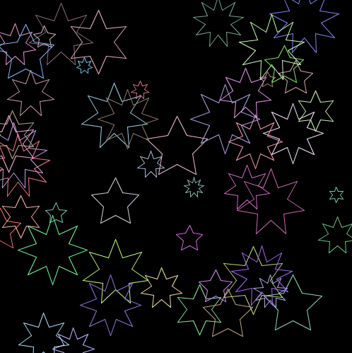
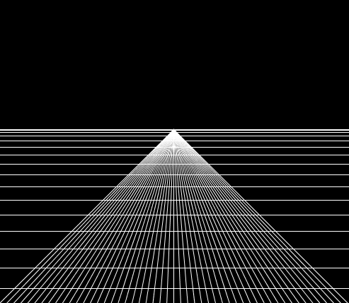
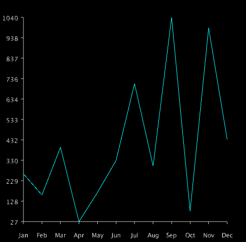
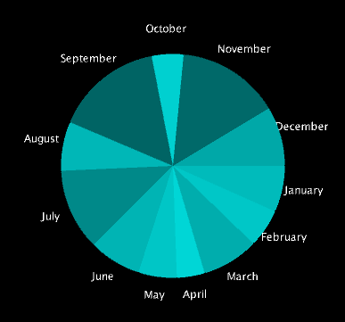
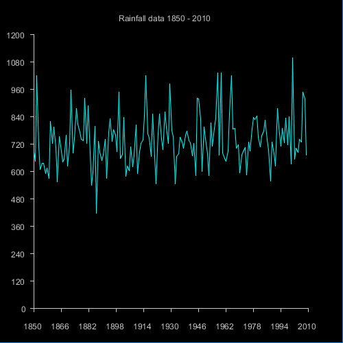
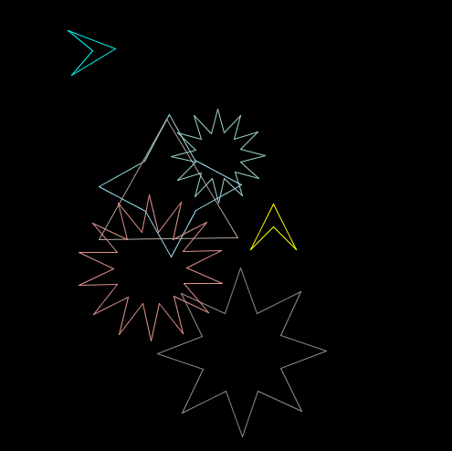
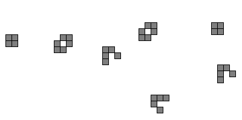
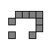
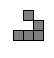

# DT228 Object Oriented Programming 2015-2016

Resources
---------
* [Assignments](assignment.md)
* [Webcourses](http://dit.ie/webcourses)
* [Slack](http://dt228-oop-2015.slack.com)
* [Processing](http://processing.org)
* [The Processing language reference](http://processing.org/reference/)
* [Learning Processing: A Beginner's Guide to Programming Images, Animation, and Interaction (Morgan Kaufmann Series in Computer Graphics)](http://http://www.learningprocessing.com/)
* [The Nature of Code](http://natureofcode.com/)
* [Eclipse](http://eclipse.org)
* [The git manual - read the first three chapters](http://git-scm.com/documentation)
* [A video tutorial all about git/github](https://www.youtube.com/watch?v=p_PGUltnB6w)
* [The Java Tutorial from Oracle](http://docs.oracle.com/javase/tutorial/)
* [Games Fleadh](http://www.gamesfleadh.ie/)
* [The Imagine Cup](https://www.imaginecup.com/)

## Contact the lecturer
* Email: bryan.duggan@dit.ie
* Twitter: [@skooter500](http://twitter.com/skooter500)
* Slack: [dt228-oop-2015.slack.com](https://dt228-oop-2015.slack.com)

# Semester

## Week 12
- [Performance of the collections framework in Java](eclipse/PerfTest)
- A video I made about this a few years ago. The video uses C#:

[](https://www.youtube.com/watch?v=KFAkRg1vB4Y)

# Lab

Here is [a link to a git repository with a Java program I use to clone lots of git repositories](https://github.com/skooter500/WebcoursesGitClone/blob/questions/src/ie/dit/WebcoursesGitClone.java). It is what I use to download all your assignments. Read the code and see if you can figure out how it works. There are questions in the comments you should try and answer.


## Week 11
- [The finished tunefinder program](eclipse/TuneFinder)

## Week 10
- [Tunes sqlite database file](docs/tunes.sqlite)
- [JDBC Tutorial](https://docs.oracle.com/javase/tutorial/jdbc/basics/processingsqlstatements.html)
- [The SQLite JDBC Driver](https://bitbucket.org/xerial/sqlite-jdbc/downloads)

# Lab
## Learning Outcomes
- Learn how to set up a JDBC connection to a database
- Learn how to set up the appropriate JDBC driver
- Learn how to run SQL statements and get results through Java
- Learn how to paramaterise an SQL query in Java
- Leran how to encapsulate rows from a table into Java objects

In this lab, we will be building on the JDBC access code we wrote in the class in order to encapsulate the results from an SQL query into an ArrayList of java objects. Firstly clone the repo for the course and import the project AudioViz2 into Eclipse. This will give you the code we made in the class. It probably won't compile without you first setting up the java libraries (which are stored in jar files) that the program depends on. You will need:

- The Processing libraries (core.jar).
- The Minim Libraries (several files).
- The sqlite JDBC driver, which you can [download from here](https://bitbucket.org/xerial/sqlite-jdbc/downloads).

Study the code in the loadTunes method of the TuneFinder class and make sure you understand what each line does. Now make the following changes:

## Part 1

- Make an ArrayList of Tune types as a field in the TuneFinder class called tunes.
- Add an appropriate toString method to the Tune class, that makes a CSV string from the fields of the class.
- Modify the method loadTunes so that it creates a new instance of the Tune class for every row returned and adds it to the arraylist. You should first empty the arraylist by calling clear.
    - I find it useful to make a constructor for the Tune class that takes a ResultSet object as a parameter and constructs the tune from this, rather than include the code for this in the loadTunes method
- Write a method called printTunes that prints all the tunes in the ArrayList, so you can test your loadTunes method.

## Part 2
- Write an overloaded loadTunes method that takes one int parameter for source. It should allow you to pass in the source id as a parameter and it should filter the results to just select tunes with the matching source id. For example, passing 4 will only load tunes that have a source of 4. You should use the PreparedStatement for this, by adding a where clause to the SQL statement. Read [this article](https://docs.oracle.com/javase/tutorial/jdbc/basics/prepared.html) that explains how to do it.
- Test this method to make sure it works!
- Write another overloaded method that takes 1 string as a parameter. This should should allow you to do a title search, so it only selects rows where the title contains the string parameter anywhere in the title. For example, passing in "merry" will only load tunes with merry in the title.
- Test this by calling printTunes

## Advanced!
- Write a method called save on the Tune class that saves a tune back to the database. It should use a PreparedStatement with an update sql query. Write some code to test this.
- Include the source name as part of the Tune object. You will also have to join to the source table in your sql statement.

## Week 7
- [Pitch detection using zero crossings and using an FFT Example program](eclipse/AudioVis2)
- And a video of the complete program:

    [](https://www.youtube.com/watch?v=d7lJ_nyCDQA)


## Week 6
- [Solution to last week's lab](java/SpellChecker2)
- [Get IntelliJ](https://www.jetbrains.com/student/)
- [Get Eclipse](https://eclipse.org/downloads)
- [Getting started with Eclipse and Processing](https://processing.org/tutorials/eclipse/)
- [A tutorial project that uses the Processing libraries through Eclipse](https://github.com/skooter500/EclipseWithProcessing)

Here is the program we wrote in the class yesterday:

```Java
package ie.dit;

import ddf.minim.AudioInput;
import ddf.minim.Minim;
import processing.core.PApplet;

public class AudioViz extends PApplet {

	Minim minum;
	AudioInput in;

	public void setup()
    {
		minum = new Minim(this);
		in = minum.getLineIn(Minim.MONO, width, 44100, 16);
    }

    public void settings()
    {
        size(530, 329);
    }

    public void draw()
    {
    	background(0);
    	stroke(255);
    	float amp = 100;
        for (int i = 0 ; i < in.bufferSize() ; i ++)
        {
        	line(i, height / 2, i, height / 2 + (in.left.get(i) * amp));
        }
    }

    public static void main(String[] args)
    {
        String[] a = {"MAIN"};
        PApplet.runSketch( a, new AudioViz());
    }
}
```

## Lab

### Learning Outcomes
- Learn how to write Java code using Eclipse
- Lear how to use the Eclipse debugger
- Learn how to link with external jar files in Eclipse
- Learn a little bit about how sound works
- Improve your computational thinking skills by implementing the zero crossings algorithm.

Today lets use Eclipse and Processing with the Minim library to implement a simple pitch detection algorithm called Zero Crossings in order to figure out the musical note that is playing. Feel free to use IntelliJ instead if you prefer.

- Get the code we worked on in the class that implements the music visualiser (above) and get it compiling in your IDE.
- Don't forget to add core.jar and the minim libraries to your Java build path! There is a [tutorial we did yesterday](https://github.com/skooter500/EclipseWithProcessing) that might be useful if you neeed to figure out how to set the Java build path. Make sure and follow the right set of instructions for the version of Processing you have installed.
- Take some time to read through this [introduction to digital audio](http://www.jiscdigitalmedia.ac.uk/guide/an-introduction-to-digital-audio) if you are interested in learning more about how digital audio and sound works. It's very interesting.

Digital audio samples the voltage coming from the microphone and stores these voltages as floating point numbers. For CD quality audio, the microphone is sampled 44100 times per second. If you play a note on an instrument like a tin-whistle or a piano and plot the samples on a graph, it would look something like this:


You might notice that this looks a little like a plot of the sin function:


However real instruments generate "harmonics" and so it will never be a perfect sine wave. These are caused by the physical properties of the instrument. That's why the plot of the music not is not a perfect sine wave.

Different musical notes are caused by the the air vibrating at different frequencies. For example, when we hear the note D the wave will repeat 293 times in a second. When we hear the note A, the wave will repeat 440 times in a second. A single "wave" in the audio is called a "period".

One simple way of figuring out the frequency, and hence that note that is playing is to count the number of periods that occur in one second. If you notice the waveforms above, you can tell when the period ends, because the signal is above 0 for one sample and then dips to 0 or below in the next sample. By counting the number of times this occurs we can tell how many periods there are. Sometimes we dont have a full second of audio, we only have a short section, but we can still use the zero crossings algorithm and just multiply the result. This segment of audio is called a frame of audio. For example, if we only have 1024 samples and we are sampling at 44100Hz, then we have (1024 / 44100) seconds of audio. This works out at .023 of a second. If we counted 41 crossings in this frame we would multiply by 1 / .023 to get a frequency of 1765. The frequency of the note A6 is 1760, so we could conclude that the note was an A. This technique won't work all the time because of the harmonics, but its a good first step. If you take the time to understand all of the above you will know something cool and amazing.

Using the Minim library, we can set the size of the frame using this code:

```Java
in = minim.getLineIn(Minim.MONO, FRAME_SIZE, sampleRate, 16);
```

You will get the best results by using bigger numbers for this. 1024 will probably work, but 2048 is better.

You can get the frame size using:

```Java
in.bufferSize()
```

You can get the actual sample by using:

```
in.left.get(SAMPLE_INDEX);
```
- Write a method in your program ```public int countZeroCrossings()``` that uses the above two methods to count and return the zero crossings. The algorithm is pretty simple, so I'll let you figure it out for yourself.
- Print out the value using the text command in Processing
- You can use [this resource](http://onlinetonegenerator.com/) to generate sine wave tones of different frequencies to test your program.
- Try singing different notes and see if your program calculates the frequencies correctly. Sing as loud as you like. You are learning.
- You might need to plug a microphone into your computer if you are using a lab computer. Headphones will work well as a microphone if you have them.

When we take a frequency and get the note name for that frequency, this is called "spelling" the frequency. Here is some Java code for the frequencies of the notes in several octaves of the the D Major scale. For musicians in the class, you will know that D Major has 2 sharps. F# and C#, so the frequencies for the notes F and C are those for F# and C#

```Java
float[] frequencies = {293.66f, 329.63f, 369.99f, 392.00f, 440.00f, 493.88f, 554.37f, 587.33f
			, 659.25f, 739.99f, 783.99f, 880.00f, 987.77f, 1108.73f, 1174.66f};
	String[] spellings = {"D,", "E,", "F,", "G,", "A,", "B,", "C", "D", "E", "F", "G", "A", "B","c", "d", "e", "f", "g", "a", "b", "c'", "d'", "e'", "f'", "g'", "a'", "b'", "c''", "d''"};
```
- Write a method called ```public String spell(float frequency)``` that takes a frequency as a parameter and returns the closest note to the frequency

Here is a video of what your finished program might look like:

[](http://www.youtube.com/watch?v=KOuete3f21c)

Login to Webcourses and do the MCQ. Jump on the slack and let me know how you get on. Post screenshots.

## Week 5
- [Exceptions in Java](http://docs.oracle.com/javase/tutorial/essential/exceptions/)
- [The Matrix class with Exceptions (The spell checker project we worked on in the class)](java\SpellChecker1)
- [Sorting an array list](http://beginnersbook.com/2013/12/java-arraylist-of-object-sort-example-comparable-and-comparator/)
- [Yoda conditions](https://en.wikipedia.org/wiki/Yoda_conditions)
- [Comparing Strings in Java](http://stackoverflow.com/questions/513832/how-do-i-compare-strings-in-java)

## Lab

### Learning outcomes
- Learn how to sort an ArrayList using the Collections framework
- Learn how to implement an interface from the JDK
- Get practice constructing an algorithm

In this lab we will implement the ability to give the print the top 10 closest words from the dictionary instead of just printing the closest match. Here is what the output of the final program might look like:


```
$ java ie.dit.Main
Enter a word or quit:
hello
Did you mean:
bell
help
hollow
jelly
well
yellow
all
ball
fall
full
Enter a word or quit:
milk
Correct match
Enter a word or quit:
moon
Correct match
Enter a word or quit:
yellow
Correct match
Enter a word or quit:
bryan
Did you mean:
bread
brown
bad
bag
band
basin
boat
boy
brake
branch
Enter a word or quit:
quit

```

To complete this lab:

- Clone the repo to get the program we worked on in the class and in the tutorial and study it carefully.
- [Read this article that explains how you can sort an ArrayList](http://beginnersbook.com/2013/12/java-arraylist-of-object-sort-example-comparable-and-comparator/). If you need to, read it several times!
- You will notice there is an unimplemented method ```public String[] findClosest(String toFind, int howMany)``` in the class Dictionary. At the moment it just returns null, but you should implement this method.
- Modify the Main method to call the new method you wrote that returns a String array instead of the method that returns a String. Make whatever other changes are necessary.
- I strongly suggest you take the time to think about how you would do this. If you can't figure it out, here are [step by step instructions](instructions.md). Only use these if you can't figure it out

- [Solution to the lab](java/SpellChecker2)

## Week 4
- [All about the Levenshtein Distance from my PhD thesis. This might be a bit complicated to read](docs/EditDistance.pdf)
- A lecture I gave about the Levenshtein Distance algorithm from a few years ago:

  [](https://www.youtube.com/watch?v=9-8Uj97J85c)

- [Transformation matrices from the Khan Academy (what we did in the tutorial)](https://www.khanacademy.org/math/precalculus/precalc-matrices/matrices-as-transformations/v/transforming-position-vector)
- [Rotation matrices](https://en.wikipedia.org/wiki/Rotation_matrix)

## Lab
### Learning Outcomes
- Have fun implementing the Levenshtein Distance. Its a cool algorithm when you get it to work :-)
- See what matrices are used for
- Build a component of a music information retrieval system

Today lets implement the Levenstein Distance algorithm (also known as the Edit Distance) in Java. Of course you can Google this and you will find lots of solutions online in 5 seconds. But don't do this. Instead, try and implement it from your memory and your notes from the class on Monday. If you weren't here then try asking one of your classmates to explain it to you instead of Googling the solution, or watch the video I put up.

Here is how I suggest you do it:

- Take the Matrix Java project we were working and use it as starter code. You can clone the repo to get it. This also has the transformations we worked on in the tutorial
- Create a new class called EditDistance.java in the same package as the other classes.
- Create a static method on the class called min3 that takes three float parameters and returns the minimum of these three numbers
- Create a static method on the class called MinimumEditDistance that takes two String parameters, neele and haystack that evaluates the minimum edit distance between needle and haystack. Implement the Levenstein Distance algorithm to calculate this. You should probably print out the matrix by calling the toString method to verify that it is set up correctly
- In the Main class, add this code:

```Java
String sa = "I love DIT";
String sb = "I love Tunepal";
System.out.println("Edit distance between: " + sa + " and: " + sb + " is " + EditDistance.MinimumEditDistance(sa, sb));

sa = "Games Fleadh";
sb = "Imagine Cup";
System.out.println("Edit distance between: " + sa + " and: " + sb + " is " + EditDistance.MinimumEditDistance(sa, sb));
```
- It should print the following:

```
$ java ie.dit.Main
0.0 1.0 2.0 3.0 4.0 5.0 6.0 7.0 8.0 9.0 10.0 11.0 12.0 13.0 14.0
1.0 0.0 1.0 2.0 3.0 4.0 5.0 6.0 7.0 8.0 9.0 10.0 11.0 12.0 13.0
2.0 1.0 0.0 1.0 2.0 3.0 4.0 5.0 6.0 7.0 8.0 9.0 10.0 11.0 12.0
3.0 2.0 1.0 0.0 1.0 2.0 3.0 4.0 5.0 6.0 7.0 8.0 9.0 10.0 11.0
4.0 3.0 2.0 1.0 0.0 1.0 2.0 3.0 4.0 5.0 6.0 7.0 8.0 9.0 10.0
5.0 4.0 3.0 2.0 1.0 0.0 1.0 2.0 3.0 4.0 5.0 6.0 7.0 8.0 9.0
6.0 5.0 4.0 3.0 2.0 1.0 0.0 1.0 2.0 3.0 4.0 5.0 6.0 7.0 8.0
7.0 6.0 5.0 4.0 3.0 2.0 1.0 0.0 1.0 2.0 3.0 4.0 5.0 6.0 7.0
8.0 7.0 6.0 5.0 4.0 3.0 2.0 1.0 1.0 3.0 3.0 5.0 5.0 7.0 7.0
9.0 8.0 7.0 6.0 5.0 4.0 3.0 2.0 2.0 2.0 3.0 6.0 6.0 6.0 7.0
10.0 9.0 8.0 7.0 6.0 5.0 4.0 3.0 2.0 3.0 3.0 7.0 7.0 7.0 7.0

Edit distance between: I love DIT and: I love Tunepal is 7.0
0.0 1.0 2.0 3.0 4.0 5.0 6.0 7.0 8.0 9.0 10.0 11.0
1.0 1.0 3.0 3.0 5.0 5.0 7.0 7.0 9.0 9.0 11.0 11.0
2.0 2.0 2.0 3.0 6.0 6.0 6.0 7.0 10.0 10.0 10.0 11.0
3.0 3.0 2.0 4.0 4.0 5.0 6.0 8.0 8.0 9.0 10.0 12.0
4.0 4.0 3.0 3.0 4.0 6.0 6.0 6.0 7.0 8.0 9.0 10.0
5.0 5.0 4.0 4.0 4.0 7.0 7.0 7.0 7.0 9.0 9.0 11.0
6.0 6.0 5.0 5.0 5.0 5.0 6.0 7.0 7.0 10.0 10.0 10.0
7.0 7.0 6.0 6.0 6.0 6.0 6.0 8.0 8.0 8.0 9.0 10.0
8.0 8.0 7.0 7.0 7.0 7.0 7.0 7.0 8.0 9.0 9.0 11.0
9.0 9.0 8.0 8.0 8.0 8.0 8.0 7.0 9.0 9.0 10.0 10.0
10.0 10.0 9.0 8.0 9.0 9.0 9.0 8.0 8.0 9.0 11.0 11.0
11.0 11.0 10.0 9.0 9.0 10.0 10.0 9.0 9.0 9.0 12.0 12.0
12.0 12.0 11.0 10.0 10.0 10.0 11.0 10.0 10.0 10.0 10.0 11.0

Edit distance between: Games Fleadh and: Imagine Cup is 11.0
```

- [Solution to the Lab](java/Levenshtein)

## Week 3
- [All about Matrices](https://www.khanacademy.org/math/precalculus/precalc-matrices)
- [Matrix multiplication](http://www.mathsisfun.com/algebra/matrix-multiplying.html)
- [Stackoverflow question about static in java](http://stackoverflow.com/questions/413898/what-does-the-static-keyword-do-in-a-class)
- [The matrix class we worked on in the class with a toString method and an add method](java/Matrix)

## Lab
Today we will be adding methods to the Matrix class to allow matrix multiplication. Check out the Matrix code we worked on in the class that implements methods for matrix addition. In the class, we implemented two methods for addition that allows us to perform the following operations:

- A+= B - This is the *non-static* method add that takes one parameter
- A = B + C - This is the *static* method that takes two parameters.

Read [this article on static in Java](http://stackoverflow.com/questions/413898/what-does-the-static-keyword-do-in-a-class) if you missed the class.

- Write a non-static method mult(Matrix b) that multiplies the current matrix by the b matrix.
- Write a static method mult(Matrix2D a, Matrix2D b) that multiplies the a and b matrices together and returns a new matrix.
- Put the following test code into your Main method:

```Java
Matrix a = new Matrix(4, 4);
a.identity();
a.setElement(2, 3, 7);
a.setElement(3, 1, 2);
a.setElement(3, 0, 4);

Matrix b = new Matrix(4, 4);
b.identity();
b.setElement(2, 3, 1);
b.setElement(3, 1, 9);
b.setElement(3, 0, -7);

Matrix2D c;
c = Matrix.mult(a, b); // How to call a static method

System.out.println(a);
System.out.println(b);
System.out.println(c);
```

Your program should output the following:

```
1.0 0.0 0.0 0.0
0.0 1.0 0.0 0.0
0.0 0.0 1.0 7.0
4.0 2.0 0.0 1.0

1.0 0.0 0.0 0.0
0.0 1.0 0.0 0.0
0.0 0.0 1.0 1.0
-7.0 9.0 0.0 1.0

1.0 0.0 0.0 0.0
0.0 1.0 0.0 0.0
-49.0 63.0 1.0 8.0
-3.0 11.0 0.0 1.0
```
## Week 2
## Lecture
- If you missed Mondays class, check out this introduction to [Java from the Java Tutorial](http://docs.oracle.com/javase/tutorial/)
- [The Matrix example we worked on in the class](java/Matrix)

# Tutorial
Today we will make some changes to the Java code we wrote in the class on Monday. Fire up the git bash shell and clone the repo for the course using:

```bash
git clone https://github.com/skooter500/DT228-OOP-2015
```
Now cd into the folder java\DogsCats

To compile the example type:

```bash
javac ie/dit/*.java
```

And to run the program type:

```bash
java ie.dit.Main
```

- Take some time to look over the code and make sure you know what's happening!
- Create a new subclass or Animal called ```Cat``` with a field for ```numLives```
- Make accessors (set and get methods) for numLives
- Write a Constructor. Call the super class constructor and also set numLives to be 9
- Write a method called kill. It should subtract 1 from numLives if numLives is > 0 and print a message. If numLives is 0, you should just print the message "I'm dead"
- In the Main class, construct a Cat instance and in a loop, call kill until the Cat is dead.

- [Collision detection in processing example](processing/CollisionDetection)

# Week 1

## Lecture

- [Overview of semester 2](https://onedrive.live.com/redir?resid=AB603D769EDBF24E!266886&authkey=!AMj4BGfaVvEb3o8&ithint=file%2cpptx)
- [Abstract classes in Java](https://docs.oracle.com/javase/tutorial/java/IandI/abstract.html)
- [Interfaces in Java](https://docs.oracle.com/javase/tutorial/java/concepts/interface.html)
- Abstract classes & interfaces class:

	[](https://www.youtube.com/watch?v=4yVTkG-a6zo)

- [The SpaceWar game with collisions, abstract classes, interfaces for powerups and bullets colliding with playeres](processing/classes6)

## Lab
- Work on your assignment

# Semester 1

# Week 1
## Lecture
* [Introduction slides](https://onedrive.live.com/redir?resid=AB603D769EDBF24E!78307&authkey=!AAILJL-DwExqnac&ithint=file%2cpptx)
* [The program we wrote in class](processing/intro/intro.pde)
* [The contract for this course](http://1drv.ms/1DbmnG9)

Some Processing assignments from previous years:

[](https://www.youtube.com/watch?v=S575a92AsuQ)

[](https://www.youtube.com/watch?v=wAEABphUJB8)

## Lab
* [Solution](processing/smileyface/smileyface.pde)

### Learning Outcomes
- Sign up for the class Slack
- Become familiar with the syntax of Processing
- Become familiar with writing and running sketches in Processing
- Practice using variables
- Practice using loops
- Practice using nested loops and the if statement
- Practice writing code to generate sequences of numbers

Firstly, go to https://dt228-oop-2015.slack.com and sign up for the slack with your DIT email address. When you are signed up, send a little greeting to everyone on the #general channel. If you have a smartphone, you might want to install the Slack app. It's free. Also if you install the app, you will probably want to disable certain notifications, otherwise your phone will be buzzing every time someone posts anything. [Here is an article that explains how to do this](https://slack.zendesk.com/hc/en-us/articles/201649323-Channel-and-group-notification-preferences).

Take the time to look up the following methods in the [Processing language reference](http://processing.org/reference/ ) to make sure you are clear about the syntax and parameters:

* line
* ellipse
* rect
* background
* stroke
* fill
* size

Here are two shapes you can draw:


Try experimenting with colours!

Now try and figure out how to draw these patterns:


(Use variables as much as possible and use a loop in your solution)

Now try this one:


Finally try this one:


Notice the mouths

Feel free to experiment with colour!

When you are finished with thes exercises, [log onto webcourses](http://dit.ie/webcourses) and complete the MCQ for this week

## Tutorial
* [The Dublin Flag sketch](processing/dublinflag)

# Week 2

## Lecture
* [The face moving in 4 directions sketch](processing/facearoundthewall)
* Data types, the if statement and dynamic sketches in Processing video (from last year)

  [](https://www.youtube.com/watch?v=Y0b9W3UJ2BU)

* The best of this weeks videos (incomplete making the moving smiley face video)

  [](https://www.youtube.com/watch?v=Wr_Ev0Xqh_U)

## Lab

### Learning Outcomes
- Practice solving problems using the if statement
- Practice using AND with an if statement

### Part 1

You can get the position where the mouse is located in Processing using the built in variables ```mouseX``` and ```mouseY```. Try printing these to the console in the ```draw()``` methdod to see how these values change as you move your mouse over the Processing window.

Make a rollover button in Processing. The button should be centred on the window and take up 30% of the width and height of the window. When you roll the mouse over the button, it should change colour from grey to blue:
Advanced! Make the button into a toggle (click on/click off) button. The button should go red when it is toggled on. In order to do this, you need to make use of the following method in your sketch:

~~~Java
void mousePressed()
~~~

This method will get called by the Processing framework whenever the mouse in pressed in the window where your sketch is running. Here is a youtube video with the completed sketch:

[](https://www.youtube.com/watch?v=YGlGRnQoDFY)

### Part 2
Implement a bouncing ball. It should move diagonally in your sketch and "bounce" off the walls.

Login to Webcourses and do the MCQ for today

[Lab 2 Solution](processing/rolloverandbounce)

## Tutorial

- [The trigonometry program we wrote in the tutorial](processing/persononbuilding)
- [This guy teaches trigonometry better than me](https://www.khanacademy.org/math/trigonometry)

# Week 3
## Lecture
- Trippy spirals Processing sketch

## Lab
### Learning outcomes
- Use variables
- Use for loops
- Use methods
- Construct an algorithm to solve a problem using sin, cos and the unit circle
- Use drawing and colours in a Processing sketch
- Use random numbers

In the lecture we learned how to make spiral shapes using a for loop with sin and cos. In the lab today you will make a sketch that draws star shapes with random numbers of points and random colours. Here is what the finished sketch could look like:



Here are some things you might need to read up on first:

- [random function in Processing](https://processing.org/reference/random_.html)
- [Using the modulus operator](http://www.cafeaulait.org/course/week2/15.html)

You can put all your code into the setup method as this sketch doesnt use any animation (unles you want to attempt the advanced part)

This is how I suggest you think about the problem.

- You will need a for loop that goes from 0 - TWO_PI. There will be twice as many steps as there are points on the star.
- You can use % (modulus) to decide whether the x and y values you calculate should be the tip of a point or base of the point (the pointy bit or the trough).
- Use line in your solution
- I strongly suggest you start the lab by just drawing a single star and then maybe move on to drawing multiple stars using a for loop.
- You could write a methdod to draw a single star with parameters

### Advanced
- Make the starts move!
- Make the stars rotate!
- Add colours!
- Go mad!

When you are done, upload an image to the slack and do this weeks MCQ.

- [Solution to the lab](processing/star)

## Tutorial
- [Try solving some of these trigonometry problems on pen and paper](http://www.tippcityschools.com/cms/lib6/OH01000855/Centricity/Domain/111/Acc%20Geom%20eDay%201.pdf)
- Try and draw the following in Processing:

  

# Week 3

## Lecture
- [Loops in Processing](processing/loops)
- Compiling and running your first Java program:

  [](https://www.youtube.com/watch?v=WXftKFCtPrQ)


## Lab
READ ALL THE INSTRUCTIONS FOR THIS LAB BEFORE STARTING!

For this lab you will be making a sketch that allows the user to convert between binary and decimal using a graphical tool that looks like this video (click to image to watch the video):

[](https://www.youtube.com/watch?v=GCziyTb0LF8)

The user should be able to click any one of the squares to "toggle" a bit on or off. The number in decimal should automatically change. For example, in the screenshot above, bits 0, 2 and 4 are turned on so the number is 1 + 4 + 16 = 21.

To complete the sketch you can use a boolean array. Remember arrays from first year? Arrays are a  collection of data all of the same type. Read  [this article that explians how arrays work in Processing](http://www.processing.org/reference/Array.html). A boolean array is just an array where every element is either true or false.

Here is a skeleton sketch to get you started if you need it, but *feel free to ignore this and just come up with your own solution*:

~~~Java
boolean[] bytes = new boolean[16];
int centX, centY;

// Probably need to declare some more variables here


void setup()
{
  size(500, 500);
  centX = width / 2;
  centY = height / 2;

  // And set their values here
}


void draw()
{
  background(127);
  // Do some stuff here

  int number = binaryToDecimal(bytes);
  // This is how you print text in Processing
  fill(255);
  text(number, centX, 100);
}

int binaryToDecimal(boolean[] bytes)
{
  int ret = 0;

  // Implement this method

  return ret;
}

void mousePressed()
{
  // Put some code here too
  // To toggle the bit on or off based on the mouse position.
}
~~~

What I suggest you do is:

- Implement the method ```int binaryToDecimal(boolean[] bytes)```.
- Set some of the bits in the bits array to be true and test the method you wrote by printing out the value.
- Write code in the ```draw()``` method to draw boxes to represent the bits. The box should be black only if the appropriate bit is true.
- Write code in the ```mousePressed()``` method to calculate which if any box the user has pressed the mouse onto and toggle the appropriate bit.

### Bonus!
- Write the decimalToBinary method that uses the divide by 2 technique to convert from a decimal number to a binary string
- Print the bit numbers over the boxes
- Implement 2's complement.
- Colours! Lights! Animations!

## Tutorial
- [Solution to the lab](processing/binaryToDecimal)
- [A slightly different solution to the lab](processing/binaryToDecimal)

# Week 5
## Lecture
- [Rainfall data program we wrote in the class](processing/data)
- [Arrays in Processing reference](https://processing.org/reference/Array.html)
- A video from last year about arrays in Processing

  [](https://www.youtube.com/watch?v=ccnjXlSnL2Y)

## Lab

### Learning outcomes
- Practice iterating over arrays in Java
- Practice in using the for loop and variables to generate sequences of numbers
- Understand how a line graph is made
- Practice constructing alogorithms as part of a system
- Practice presenting data visually

Log into the slack and let me know how you are getting on.

Use the code you wrote yesterday in the class as starter code for today's lab.
If you missed the class, [this is a link to my version](processing/datawip).

Here is what you can try and make today:



These are the steps I suggest you follow:

- Figure out how to draw a trend line graph first
- Then figure out how to leave horizontal and vertical borders around the graph. I would suggest making a variable called border to control this.
- Then figure out how to scale it so that it scales the data when drawing to the range 0-150. You could make this a variable
- Then figure out how to draw the horizontal axis. This will be a for loop obviously. You might find the following Java/Processing methods useful:
  - [The Processing map method](https://processing.org/reference/map_.html)
  - [textAlign](https://processing.org/reference/textAlign_.html)
  - [substring](http://www.tutorialspoint.com/java/java_string_substring.htm)
- Finally figure out how to draw the vertical axis. Another loop! This is the trickiest part I think

Try and parameterise as much of your sketch with variables, so that you could reuse the code to graph other types of data.
For example, I found it useful to write a method:

```Java
void drawAxis(float[] data, String[] horizLabels, int verticalIntervals, int maxVertical, float border)
```

to draw the horizontal and vertical axes. You might like to write seperate methods for the horizontal and vertical axis.
This took me about an hour to complete today, so it's tricky enough to get everything working, but worth it!
Take a screenshot of your sketch and [upload it to the slack](http://dt228-oop-2015.slack.com)!

### Advanced!

Try and draw this pie chart:



Upload screenshots of your sketches and log on to webcourses to do today's MCQ.

## Tutorial
- [Solution to the lab](processing/data)
- Video of the tutorial: Making the trend line graph in Processing:

    [](https://www.youtube.com/watch?v=K9R5yQCPXIE)

# Week 6
## Lecture
- [Weather dataset project](processing/weatherData)
- [ArrayList in Processing](https://processing.org/reference/ArrayList.html)
- [map method in Processing](https://processing.org/reference/map_.html)
- [split a String in Java](http://www.tutorialspoint.com/java/java_string_split.htm)
- [The program we wrote in the class](processing/files1)
- Video of the lecture all about map, ArrayList's, splitting strings, converting String to float:

[](https://www.youtube.com/watch?v=jMC_y9Nhq04)


## Lab

### Learning outcomes
- Learn how to replace an array with an ArrayList
- Learn how to use the Processing map method
- Learn how to load a dataset from a csv file
- Learn how to constrct algorithms to iterate over a dataset

Staring with [the program we wrote in the class](processing/files1) yesterday, write code to do the folowing:

- Print the year with the most rainfall
- Calculate the average rainfall

Now add some code to draw a trend graph of the rainfall data from 1850 - 2010. You can use the code from last week's lab to figure out how to draw the trend line. You should adapt the code in the following ways:

- Use ArrayLists instead of an arrays
- Refactor the code to use the processing *map* method wherever possible. SPend 20 minutes analysing the code to look for all opportunities to replace calculations and variables with the Processing map method. I found loads of places where it simplified the code.



Instead of downloading the code from the website, you can clone the git repository for the course if you want to. It's not very hard. Just fire up a command prompt on your computer and type:

```bash
git clone http://github.com/skooter500/DT228-OOP-2015
```

Spend some time figuring out the lab before you attempt to code it!

Advanced!

The file Dublin Airport.csv contains the rainfall data by month from 1850 - 2010. Open the file in Notepad++ to see what format the file is in. Some stuff for you to try:

- Load the data from the file into an ArrayList of ArrayLists. In other words, each entry in the first ArrayList will be an ArrayList of floats ike this:

  ```Java
  ArrayList<ArrayList<Float>> data = new ArrayList<ArrayList<Float>>();
  ```

  Each entry in the first ArrayList will be an ArrayList containing the rainfall data by month for a year.

  I suggest you skip over the year part when reading the file and just store the data. It will make your calculations easier.

- Write code to figure out what *month* in the range 1850-2010 had the lowest and highest recorded rainfall

- [Solution to various parts (not all) of the lab](processing/weatherData1)

# Week 7

## Lecture
- No lecture

## Lab
- Work on the assignment

## Tutorial
- [Slides from the tutorial](https://onedrive.live.com/redir?resid=AB603D769EDBF24E!264952&authkey=!ADQ7OV2Yx73_Sw8&ithint=file%2cpptx)
- [Audio Visualiser Processing example](processing/audioVisualiser)
- [Harmonic motion animation](processing/harmonic)

# Week 8
## Lecture
- [Classes in Processing example we wrote in the class](processing/classes)
- Video from the class:

	[](https://www.youtube.com/watch?v=t7kbuD-_bCE)

- [An excellent introduction to git video made by Paul Doyle](https://media.heanet.ie/page/6fac13d8ea21e74ea406a38fdae7c193)


## Lab
### Learning Outcomes
- Clone a git repository
- Set up a github account
- Create a git repository
- Make commits
- Make a class in Processing

Today let's try and do some git stuff. For a start try cloning the git repository for the course.

- Fire up the bash shell and cd to folder that you want to clone the repo to and type:

	```bash
	git clone https://github.com/skooter500/DT228-OOP-2015
	```

	After a few seconds you will have your own copy of the repository for the course.

- Now lets create a Processing sketch and commit it to github. If you dont have one already, go and [create an account on github](http://github.com). At some stage you should sign up for the [github education program](https://education.github.com/) that gives you the ability to create private repos.
- Now create a new Processing sketch and add some code. Save the Processing sketch and call it whatever you like. For this lab, I will assume the sketch is called spacewar.
- Logon to your github account and create a repo for spacewar.

	

	Don't forget to set:
	- The repository name
	- A description for the repository
	- Set the repository to be public
	- Make sure "Initialize this repository with a README" is checked
	- Make sure you choose Processing for the gitignore
	- Add an MIT license


- From the bash shell, cd to the folder where you have your sketch saved and type:

	```bash
	git init
	git remote add origin THE_URL_TO_THE_REPO_YOU_JUST_MAKE
	git pull origin master
	```

	I usually copy and paste the url from the browser. Ctrl + C and Shift + Insert on Windows, Cmd + C and Cmd + V will do the same job on the Mac. Crtl + C and Crtl + V will do this on Linux
- Navigate to the folder in Windows Explorer/Mac Finder etc and see that the files you created on github have been pulled. You should see the .gitignore and README files. Open them up in Notepad++ and take a look at the contents.
- Edit the README file and add some additional contents. The format of this file is called markdown. Here is a [quick reference to Markdown](https://github.com/adam-p/markdown-here/wiki/Markdown-Cheatsheet). Its a simple and cool file format.
- If you haven't already, you need to tell git your name and email address:

	```bash
	git config --global user.name "Your name"
	git config --global user.email "your_email@example.com"
	```

- Now lets commit our changes and push the local changes to github. At the bash shell type:

	```bash
	git add .
	git commit -m "Initial version"
	git push --set-upstream origin master
	```
- In your web browser, go to the github repository you created and verify that your files are all commited.
- Now lets make a change and make another commit. Edit your processing sketch and save the changes. Then type:

	```bash
	git add .
	git commit -m "Changes"
	git push
	```
- Verify that your changes have been pushed successfully
- Now lets make a branch. At the bash shell type:

	```bash
	git checkout -b new_branch
	```

	The -b flag means create a new branch. When you checkout a branch that means you switch to the branch and any commits you make from now will be on that branch.

- Add a comment to the Processing sketch and save it.
- At the bash shell type:

	```bash
	git add .
	git commit -m "On the new branch"
	git push --set-upstream origin new_branch
	```

	Note! The --set-upstream origin new_branch is only necessary the first time you push to a new branch. It creates the connection between the local branch and the remote branch

	Go to the repo page in your browser and verify that the new branch has been created.

- Now lets switch branches to the master branch. Type:

	```bash
	git checkout master
	```

- Close Processing and then reopen the sketch. You should see the version of the file before you made the changes on the new_branch
- Type:

	```bash
	git merge new_branch
	```

	To merge the changes from new_branch into the master branch

- Commit and push your changes to the master branch (try and figure this out yourself)
- Some other git commands you should try. Look up their meaning!

	```
	git status
	git log
	```

Last thing! Create a git repository for you assignmenmt. Maybe try and make some classes to encapsulate rows of data from your dataset. For example, if your dataset looked like this:

```
James Bannon,FG,Longford-Westmeath,40542.72
Sean Barrett,CC,Dun Laoghaire, 13111.75
...
...
```

You could create a class that loked like this:

```Java
class Expense
{
  String name;
  String party;
  String region;
  float claimed;
}
```

To encapsulate a row of data from the file

Log onto webcourses and do the MCQ for today. I will be on the slack if you have any questions.

- [Last years lab test 1 with solution](processing/ExpensesProcessing)

## Tutorial
- Video of the tutorial (the first part of the lab test from last year):

	[](https://www.youtube.com/watch?v=v7o1CzGIJuE)

- [Code we wrote in the tutorial](processing/expensesWIP)

# Week 9
## Lecture
- Lecture video all about PVectors, pushMatrix, popMatrix, encapsulation, constructors, object references

	[](https://www.youtube.com/watch?v=XwniJyTIdec)

- [Using PVectors & classes in a Processing sketch (the program we wrote in the class)](processing/classes1)

## Lab
- [Lab Test 1](https://github.com/skooter500/irishEconomyStarterCode)

## Tutorial
- [Pie chart with atan2 example](processing/piechart)
- [Lots of things you can do with Strings in Java](processing/strings)

# Week 10
## Lecture
- Lecture all about making game objects in Processing using encapsulation and inheritance

	[](https://www.youtube.com/watch?v=5jnR-C6OqUQ)

- [Making AIShip and Bullet classes (the program we wrote in the class](processing/classes2)
- [Solution to the lab test](processing/irishEconomy)

## Lab
### Learning outcomes
- Design algorithms and classes as part of a system
- Create instances of classes, with different field values
- Know how to manage objects in an ArrayList

Logon to [Slack](http://dt228-oop-2015.slack.com) and lets chat about code.

You might want to clone/pull the repo for the course to get the code from yesterday:

```bash
git clone https://github.com/skooter500/DT228-OOP-2015
```

The goals of today's lab:

- Start with the code from yesterday
- Add multiple ships with different keyboard controls. For example, one Ship could use WASD and another ship could use IJKL
- Each ship should have it's own colour
- Bullets should take the ship colour
- The players wrap around if they go off the bounds of the screen

Advanced!
- Bullets get removed from the scene when they go out of bounds of the scene
- Ships can only fire 5 bullets per second

I could tell you how to do all the above, but you will have much more fun if you figure all this out yourselves :-)I suggest you form teams of no more than 3 people and spend the first half of the lab studying the code from yesterday and coming up with a plan to implement each of the above goals.

Some hints:

- USe OO principles as much as possible. Use methods, fields and constructors.
- The ```draw``` method in Processing gets called 60 times per second, so you can us this to time things!

Here is a video of what it could look like:

[](https://www.youtube.com/watch?v=LC3uRd8ESSA)

Upload a picture of whatever you made today to [Slack](http://dt228-oop-2015.slack.com). Dont be shy!!

- [Solution](processing/DogsCats)

# Week 11
## Lecture
- [Dogs Cats and Sheep code](processing/DogsCats)
- Video of the class:

	[](https://www.youtube.com/watch?v=nt2DzM5n8iw)

## Lab
### Learning Outcomes
- Refactor a program to use Polymorphism
- Apply polymorphism to a real world problem
- Practice creating a class with a constructor
- Practice using Polymorphism with an ArrayList

Lets take the stuff we learned in the class and apply it to the SpaceWars game we are making. Instead of keeping track of instances of Ship and Bullets seperately, keep an ArrayList of GameObject's and use Polymorphism. You can start with your own code or [use the solution to last weeks lab that I made](processing/classes3). You will need to add update and render methods to the GameObject along with some other stuff you can figure out for yourself.

This should be pretty easy to do, so as an additional challenge, you can make a Star class. It should extend GameObject and it should rotate clockwise by itself. You should make a constructor that takes the x, y, radius, color and number of points. If you can't figure out how to draw the star using trigonometry, check out [this example from earlier in the course](processing/star). Creats some instances of the star. This is what my sketch looks like with 5 random stars on the screen



Note!
- Sometimes using polymorphism and ArrayLists can reduce code, but even so, it is sometimes necessary in a complex system to keep separate references to different types of objects. You can check out the complete [SpaceWars game in Processing on my git repository](https://github.com/skooter500/YASC).

Let me see what you are working on by uploading a picture of your sketch to the slack.
Log onto webcourses and do today's MCQ

- [Solution to the lab](processing/classes4)

## Tutorial
- [The program we wrote in the tutorial. A simple example of polymorphism](processing/polymorphism)

# Week 12
- [Abstract classes in Java](https://docs.oracle.com/javase/tutorial/java/IandI/abstract.html)
- [Interfaces in Java](https://docs.oracle.com/javase/tutorial/java/concepts/interface.html)
- Abstract classes & interfaces class:

	[](https://www.youtube.com/watch?v=4yVTkG-a6zo)

- [The SpaceWar game with collisions, abstract classes & interfaces for powerups](processing/classes5)

# Week 13
## Lecture
- [Assignment 1 Submission](https://docs.google.com/forms/d/1hAXUczgwlgU9hrjbXBWwVPl8gcLX7h4KXFikYtNfaZk/viewform)
- Stephen Hawkings on the Game of Life:

	[](https://www.youtube.com/watch?v=CgOcEZinQ2I)

- John Conway on the Game of Life:

	[](https://www.youtube.com/watch?v=C2vgICfQawE)

- Epic Conway's Game of Life:

	[](https://www.youtube.com/watch?v=FdMzngWchDk)

- And finally, Alan Watts

	[](https://www.youtube.com/watch?v=wU0PYcCsL6o)

- [Conway's Game of Life on Wikipedia](https://en.wikipedia.org/wiki/Conway%27s_Game_of_Life)
- [The Game of Life Wiki](http://www.conwaylife.com/wiki/Main_Page)

## Lab

Pleas take 5 minutes to [give me your thoughts about how this semester went](https://docs.google.com/forms/d/15pM31sUPP2SM5igDtr-TUDsBGFTSCoBEyxCG4yNzrMY/viewform).

Try and complete the Game of Life we started in the class yesterday. If you weren't in the class, you could take a read of the Game of Life wiki page and have a crack at implementing it from scratch yourselves. It's not too difficult. If you get your basic game of life to evolve, you could try these additions:

- The method ```void mousePressed()``` gets called in your sketch whenever the mouse is pressed. The method ```mouseDragged``` gets called whenever you hold the mouse down and move it over your sketch. You can get the mouse x and y coordinates by using the built in variables ```mouseX``` and ```mouseY```. You can use these methods to implement mouse drawing. To do this you need to calculate which row and column in the 2D array the mouse is over and then set this cell to be true.
- When you press the c key, the board should clear. In otherwords, you should set every element in th 2D array to be false.
- When you press the r key, you should randomly set 50% of the elements to be true. To do this, you need to iterate through the array and generate a random number between 0.0f and 1.0f. If the number is > 0.5f, you set the element to be true otherwise set it to be false.

There some interesting starting patterns you can program also. You could write code so that when you press a number key it creates the starting pattern at the mouse x and y. I used the mouse x and y to be the top left of the shape.

| Pattern | Description |
|---------|-------------|
| | Gosper Gun |
| | Lightweight spaceship |
| | Tumbler |
| | Glider |
| | I'm not sure what this is called, but it makes amazing patterns |

Here is a video of what my sketch looks like:

[](https://www.youtube.com/watch?v=72X38iT74As)

